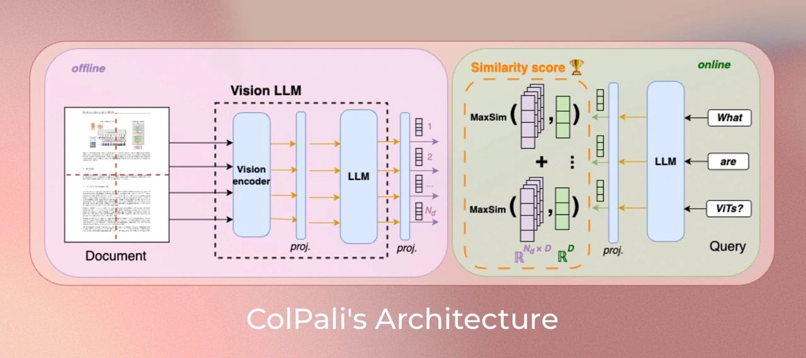

# ColPali: Efficient Document Retrieval with Vision Language Models 👀

[](https://arxiv.org/abs/2407.01449)
[](https://github.com/illuin-tech/vidore-benchmark)
[](https://huggingface.co/vidore)
[](https://github.com/tonywu71/colpali-cookbooks)

[](https://github.com/illuin-tech/colpali/actions/workflows/test.yml)
[](https://pypi.org/project/colpali-engine/)
[](https://pepy.tech/project/colpali-engine)

---

[[Model card]](https://huggingface.co/vidore/colpali)
[[ViDoRe Leaderboard]](https://huggingface.co/spaces/vidore/vidore-leaderboard)
[[Demo]](https://huggingface.co/spaces/manu/ColPali-demo)
[[Blog Post]](https://huggingface.co/blog/manu/colpali)

## Associated Paper

This repository contains the code used for training the vision retrievers in the [*ColPali: Efficient Document Retrieval with Vision Language Models*](https://arxiv.org/abs/2407.01449) paper. In particular, it contains the code for training the ColPali model, which is a vision retriever based on the ColBERT architecture and the PaliGemma model.

## Introduction

With our new model *ColPali*, we propose to leverage VLMs to construct efficient multi-vector embeddings in the visual space for document retrieval. By feeding the ViT output patches from PaliGemma-3B to a linear projection, we create a multi-vector representation of documents. We train the model to maximize the similarity between these document embeddings and the query embeddings, following the ColBERT method.

Using ColPali removes the need for potentially complex and brittle layout recognition and OCR pipelines with a single model that can take into account both the textual and visual content (layout, charts, ...) of a document.



## List of ColVision models

| Model                                                        | Score on [ViDoRe](https://huggingface.co/spaces/vidore/vidore-leaderboard) 🏆 | License    | Comments                                                     | Currently supported |
| ------------------------------------------------------------ | ------------------------------------------------------------ | ---------- | ------------------------------------------------------------ | ------------------- |
| [vidore/colpali](https://huggingface.co/vidore/colpali)      | 81.3                                                         | Gemma      | • Based on `google/paligemma-3b-mix-448`.<br />• Checkpoint used in the ColPali paper. | ❌                   |
| [vidore/colpali-v1.1](https://huggingface.co/vidore/colpali-v1.1) | 81.5                                                         | Gemma      | • Based on `google/paligemma-3b-mix-448`.                    | ✅                   |
| [vidore/colpali-v1.2](https://huggingface.co/vidore/colpali-v1.2) | 83.9                                                         | Gemma      | • Based on `google/paligemma-3b-mix-448`.                    | ✅                   |
| [vidore/colqwen2-v0.1](https://huggingface.co/vidore/colqwen2-v0.1) | 87.3                                                         | Apache 2.0 | • Based on `Qwen/Qwen2-VL-2B-Instruct`.<br />• Supports dynamic resolution.<br />• Trained using 768 image patches per page and an effective batch size of 32. | ✅                   |
| [vidore/colqwen2-v1.0](https://huggingface.co/vidore/colqwen2-v1.0) | 89.3                                                         | Apache 2.0 | • Similar to `vidore/colqwen2-v0.1`, but trained with more powerful GPUs and with a larger effective batch size (256). | ✅                   |

## Setup

We used Python 3.11.6 and PyTorch 2.4 to train and test our models, but the codebase is compatible with Python >=3.9 and recent PyTorch versions. To install the package, run:

```bash
pip install colpali-engine
```

> [!WARNING]
> For ColPali versions above v1.0, make sure to install the `colpali-engine` package from source or with a version above v0.2.0.

## Usage

### Quick start

```python
import torch
from PIL import Image

from colpali_engine.models import ColQwen2, ColQwen2Processor

model_name = "vidore/colqwen2-v0.1"

model = ColQwen2.from_pretrained(
    model_name,
    torch_dtype=torch.bfloat16,
    device_map="cuda:0",  # or "mps" if on Apple Silicon
).eval()

processor = ColQwen2Processor.from_pretrained(model_name)

# Your inputs
images = [
    Image.new("RGB", (32, 32), color="white"),
    Image.new("RGB", (16, 16), color="black"),
]
queries = [
    "Is attention really all you need?",
    "Are Benjamin, Antoine, Merve, and Jo best friends?",
]

# Process the inputs
batch_images = processor.process_images(images).to(model.device)
batch_queries = processor.process_queries(queries).to(model.device)

# Forward pass
with torch.no_grad():
    image_embeddings = model(**batch_images)
    query_embeddings = model(**batch_queries)

scores = processor.score_multi_vector(query_embeddings, image_embeddings)

```

### Inference

You can find an example [here](https://github.com/illuin-tech/colpali/blob/main/scripts/infer/run_inference_with_python.py). 


### Benchmarking

To benchmark ColPali to reproduce the results on the [ViDoRe leaderboard](https://huggingface.co/spaces/vidore/vidore-leaderboard), it is recommended to use the [`vidore-benchmark`](https://github.com/illuin-tech/vidore-benchmark) package.

### Interpretability with similarity maps

By superimposing the late interaction similarity maps on top of the original image, we can visualize the most salient image patches with respect to each term of the query, yielding interpretable insights into model focus zones.

To use the `interpretability` module, you need to install the `colpali-engine[interpretability]` package:

```bash
pip install colpali-engine[interpretability]
```

Then, after generating your embeddings with ColPali, use the following code to plot the similarity maps for each query token:

```python
import torch
from PIL import Image

from colpali_engine.interpretability import (
    get_similarity_maps_from_embeddings,
    plot_all_similarity_maps,
)
from colpali_engine.models import ColPali, ColPaliProcessor
from colpali_engine.utils.torch_utils import get_torch_device

model_name = "vidore/colpali-v1.2"
device = get_torch_device("auto")

# Load the model
model = ColPali.from_pretrained(
    model_name,
    torch_dtype=torch.bfloat16,
    device_map=device,
).eval()

# Load the processor
processor = ColPaliProcessor.from_pretrained(model_name)

# Load the image and query
image = Image.open("shift_kazakhstan.jpg")
query = "Quelle partie de la production pétrolière du Kazakhstan provient de champs en mer ?"

# Preprocess inputs
batch_images = processor.process_images([image]).to(device)
batch_queries = processor.process_queries([query]).to(device)

# Forward passes
with torch.no_grad():
    image_embeddings = model.forward(**batch_images)
    query_embeddings = model.forward(**batch_queries)

# Get the number of image patches
n_patches = processor.get_n_patches(image_size=image.size, patch_size=model.patch_size)

# Get the tensor mask to filter out the embeddings that are not related to the image
image_mask = processor.get_image_mask(batch_images)

# Generate the similarity maps
batched_similarity_maps = get_similarity_maps_from_embeddings(
    image_embeddings=image_embeddings,
    query_embeddings=query_embeddings,
    n_patches=n_patches,
    image_mask=image_mask,
)

# Get the similarity map for our (only) input image
similarity_maps = batched_similarity_maps[0]  # (query_length, n_patches_x, n_patches_y)

# Tokenize the query
query_tokens = processor.tokenizer.tokenize(query)

# Plot and save the similarity maps for each query token
plots = plot_all_similarity_maps(
    image=image,
    query_tokens=query_tokens,
    similarity_maps=similarity_maps,
)
for idx, (fig, ax) in enumerate(plots):
    fig.savefig(f"similarity_map_{idx}.png")
```

For a more detailed example, you can refer to the interpretability notebooks from the [ColPali Cookbooks 👨🏻‍🍳](https://github.com/tonywu71/colpali-cookbooks) repository.

### Training

To keep a lightweight repository, only the essential packages were installed. In particular, you must specify the dependencies to use the training script for ColPali. You can do this using the following command:

```bash
pip install "colpali-engine[train]"
```

All the model configs used can be found in `scripts/configs/` and rely on the [configue](https://github.com/illuin-tech/configue) package for straightforward configuration. They should be used with the `train_colbert.py` script.

#### Example 1: Local training

```bash
USE_LOCAL_DATASET=0 python scripts/train/train_colbert.py scripts/configs/pali/train_colpali_docmatix_hardneg_model.yaml
```

or using `accelerate`:

```bash
accelerate launch scripts/train/train_colbert.py scripts/configs/pali/train_colpali_docmatix_hardneg_model.yaml
```

#### Example 2: Training on a SLURM cluster

```bash
sbatch --nodes=1 --cpus-per-task=16 --mem-per-cpu=32GB --time=20:00:00 --gres=gpu:1  -p gpua100 --job-name=colidefics --output=colidefics.out --error=colidefics.err --wrap="accelerate launch scripts/train/train_colbert.py scripts/configs/pali/train_colpali_docmatix_hardneg_model.yaml"

sbatch --nodes=1  --time=5:00:00 -A cad15443 --gres=gpu:8  --constraint=MI250 --job-name=colpali --wrap="python scripts/train/train_colbert.py scripts/configs/pali/train_colpali_docmatix_hardneg_model.yaml"
```

## Community Projects

Several community projects and ressources have been developed around ColPali to facilitate its usage. Feel free to reach out if you want to add your project to this list!

### Libraries 📚

| Library Name  | Description                                                                                                                                                                                                                                          |
|---------------|----------------------------------------------------------------------------------------------------------------------------------------------------------------------------------------------------------------------------------------------------  |
| Byaldi        | [`Byaldi`](https://github.com/AnswerDotAI/byaldi) is [RAGatouille](https://github.com/AnswerDotAI/RAGatouille)'s equivalent for ColPali, leveraging the `colpali-engine` package to facilitate indexing and storing embeddings.                      |
| PyVespa       | [`PyVespa`](https://pyvespa.readthedocs.io/en/latest/examples/colpali-document-retrieval-vision-language-models-cloud.html) allows interaction with [Vespa](https://vespa.ai/), a production-grade vector database, with detailed ColPali support.   |
| Candle        | [Candle](https://github.com/huggingface/candle/tree/main/candle-examples/examples/colpali) enables ColPali inference with an efficient ML framework for Rust.                                                                                        |
| EmbedAnything | [`EmbedAnything`](https://github.com/StarlightSearch/EmbedAnything) Allows end-to-end ColPali inference with both Candle and ONNX backend.                                                                                                           |
| DocAI         | [DocAI](https://github.com/PragmaticMachineLearning/docai) uses ColPali with GPT-4o and Langchain to extract structured information from documents.                                                                                                  |
| VARAG         | [VARAG](https://github.com/adithya-s-k/VARAG) uses ColPali in a vision-only and a hybrid RAG pipeline.                                                                                                                                               |
| ColBERT Live! | [`ColBERT Live!`](https://github.com/jbellis/colbert-live/) enables ColPali usage with vector databases supporting large datasets, compression, and non-vector predicates.                                                                           |
| ColiVara      | [`ColiVara`](https://github.com/tjmlabs/ColiVara/) is retrieval API that allows you to store, search, and retrieve documents based on their visual embedding. It is a web-first implementation of the ColPali paper using ColQwen2 as the LLM model. |
| BentoML       | Deploy ColPali easily with BentoML using [this example repository](https://github.com/bentoml/BentoColPali). BentoML features adaptive batching and zero-copy I/O to minimize overhead.                                                              |

### Notebooks 📙

| Notebook Title                                                                                                      | Author & Link                                                                                                                                   |
|---------------------------------------------------------------------------------------------------------------------|-------------------------------------------------------------------------------------------------------------------------------------------------|
| ColPali Cookbooks                                                                                                   | [Tony's Cookbooks (ILLUIN)](https://github.com/tonywu71/colpali-cookbooks) 🙋🏻                                                                   |
| Vision RAG Tutorial                                                                                                 | [Manu's Vision Rag Tutorial (ILLUIN)](https://github.com/ManuelFay/Tutorials/blob/main/Tuesday_Practical_2_Vision_RAG.ipynb) 🙋🏻                 |
| ColPali (Byaldi) + Qwen2-VL for RAG                                                                                 | [Merve's Notebook (HuggingFace 🤗)](https://github.com/merveenoyan/smol-vision/blob/main/ColPali_%2B_Qwen2_VL.ipynb)                            |
| Indexing ColPali with Qdrant                                                                                        | [Daniel's Notebook (HuggingFace 🤗)](https://danielvanstrien.xyz/posts/post-with-code/colpali-qdrant/2024-10-02_using_colpali_with_qdrant.html) |
| Weaviate Tutorial                                                                                                   | [Connor's ColPali POC (Weaviate)](https://github.com/weaviate/recipes/blob/main/weaviate-features/named-vectors/NamedVectors-ColPali-POC.ipynb) |
| Use ColPali for Multi-Modal Retrieval with Milvus                                                                   | [Milvus Documentation](https://milvus.io/docs/use_ColPali_with_milvus.md)                                                                       |
| Data Generation                                                                                                     | [Daniel's Notebook (HuggingFace 🤗)](https://danielvanstrien.xyz/posts/post-with-code/colpali/2024-09-23-generate_colpali_dataset.html)         |
| Finance Report Analysis with ColPali and Gemini                                                                     | [Jaykumaran (LearnOpenCV)](https://github.com/spmallick/learnopencv/tree/master/Multimodal-RAG-with-ColPali-Gemini)                             |
| Multimodal Retrieval-Augmented Generation (RAG) with Document Retrieval (ColPali) and Vision Language Models (VLMs) | [Sergio Paniego](https://huggingface.co/learn/cookbook/multimodal_rag_using_document_retrieval_and_vlms)                                        |
| Document Similarity Search with ColPali                                                                             | [Frank Sommers](https://colab.research.google.com/github/fsommers/documentai/blob/main/Document_Similarity_with_ColPali_0_2_2_version.ipynb)    |
| End-to-end ColPali inference with EmbedAnything                                                                     | [Akshay Ballal (EmbedAnything)](https://colab.research.google.com/drive/1-Eiaw8wMm8I1n69N1uKOHkmpw3yV22w8?usp=sharing)                          |
| ColiVara: A ColPali Retrieval API                                                                                   | [A simple RAG Example](https://github.com/tjmlabs/ColiVara-docs/blob/main/cookbook/RAG.ipynb)                                                   |

### Other resources

- 📝 = blog post
- 📋 = PDF / slides
- 📹 = video

| Title                                                                                    | Author & Link                                                                                                                                                 |
|------------------------------------------------------------------------------------------|---------------------------------------------------------------------------------------------------------------------------------------------------------------|
| State of AI report 2024                                                                  | [Nathan's report](https://www.stateof.ai/) 📋                                                                                                                 |
| Technology Radar Volume 31 (October 2024)                                                | [thoughtworks's report](https://www.thoughtworks.com/radar) 📋                                                                                                |
| LlamaIndex Webinar: ColPali - Efficient Document Retrieval with Vision Language Models   | [LlamaIndex's Youtube video](https://youtu.be/nzcBvba7mzI?si=WL9MsyiAFJMyEolz) 📹                                                                             |
| PDF Retrieval with Vision Language Models                                                | [Jo's blog post #1 (Vespa)](https://blog.vespa.ai/retrieval-with-vision-language-models-colpali/) 📝                                                          |
| Scaling ColPali to billions of PDFs with Vespa                                           | [Jo's blog post #2 (Vespa)](https://blog.vespa.ai/scaling-colpali-to-billions/) 📝                                                                            |
| Neural Search Talks: ColPali (with Manuel Faysse)                                        | [Zeta Alpha's Podcast](https://open.spotify.com/episode/2s6ljhd6VQTL2mIU9cFzCb) 📹                                                                            |
| Multimodal Document RAG with Llama 3.2 Vision and ColQwen2                               | [Zain's blog post (Together AI)](https://www.together.ai/blog/multimodal-document-rag-with-llama-3-2-vision-and-colqwen2) 📝                                  |
| ColPali: Document Retrieval with Vision Language Models                                  | [Antaripa Saha](https://antaripasaha.notion.site/ColPali-Efficient-Document-Retrieval-with-Vision-Language-Models-10f5314a5639803d94d0d7ac191bb5b1) 📝        |
| Minimalist diagrams explaining ColPali                                                   | [Leonie's ColPali diagrams on X ](https://twitter.com/helloiamleonie/status/1839321865195851859)📝                                                            |
| Multimodal RAG with ColPali and Gemini : Financial Report Analysis Application           | [Jaykumaran's blog post (LearnOpenCV)](https://learnopencv.com/multimodal-rag-with-colpali/) 📝                                                               |
| Implement Multimodal RAG with ColPali and Vision Language Model Groq(Llava) and Qwen2-VL | [Plaban's blog post](https://medium.com/the-ai-forum/implement-multimodal-rag-with-colpali-and-vision-language-model-groq-llava-and-qwen2-vl-5c113b8c08fd) 📝 |
| multimodal AI. open-source. in a nutshell.                                               | [Merve's Youtube video](https://youtu.be/IoGaGfU1CIg?si=yEhxMqJYxvMzGyUm) 📹                                                                                  |
| Remove Complexity from Your RAG Applications                                             | [Kyryl's blog post (KOML)](https://kyrylai.com/2024/09/09/remove-complexity-from-your-rag-applications/) 📝                                                   |
| Late interaction & efficient Multi-modal retrievers need more than a vector index        | [Ayush Chaurasia (LanceDB)](https://blog.lancedb.com/late-interaction-efficient-multi-modal-retrievers-need-more-than-just-a-vector-index/) 📝                |
| Optimizing Document Retrieval with ColPali and Qdrant's Binary Quantization              | [Sabrina Aquino (Qdrant)]( https://youtu.be/_A90A-grwIc?si=MS5RV17D6sgirCRm)  📹                                                                              |
| Hands-On Multimodal Retrieval and Interpretability (ColQwen + Vespa)                     | [Antaripa Saha](https://www.analyticsvidhya.com/blog/2024/10/multimodal-retrieval-with-colqwen-vespa/) 📝                                                     |

## Paper result reproduction

To reproduce the results from the paper, you should checkout to the `v0.1.1` tag or install the corresponding `colpali-engine` package release using:

```bash
pip install colpali-engine==0.1.1
```

## Citation

**ColPali: Efficient Document Retrieval with Vision Language Models**  

Authors: **Manuel Faysse**\*, **Hugues Sibille**\*, **Tony Wu**\*, Bilel Omrani, Gautier Viaud, Céline Hudelot, Pierre Colombo (\* denotes equal contribution)

```latex
@misc{faysse2024colpaliefficientdocumentretrieval,
      title={ColPali: Efficient Document Retrieval with Vision Language Models}, 
      author={Manuel Faysse and Hugues Sibille and Tony Wu and Bilel Omrani and Gautier Viaud and Céline Hudelot and Pierre Colombo},
      year={2024},
      eprint={2407.01449},
      archivePrefix={arXiv},
      primaryClass={cs.IR},
      url={https://arxiv.org/abs/2407.01449}, 
}
```
